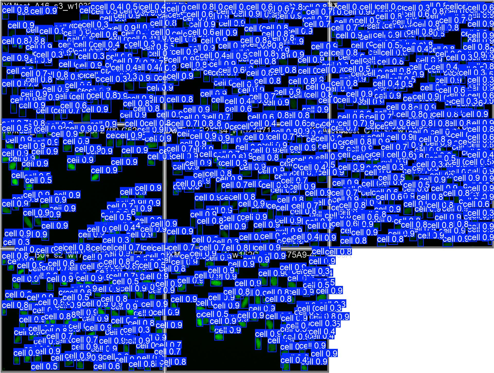
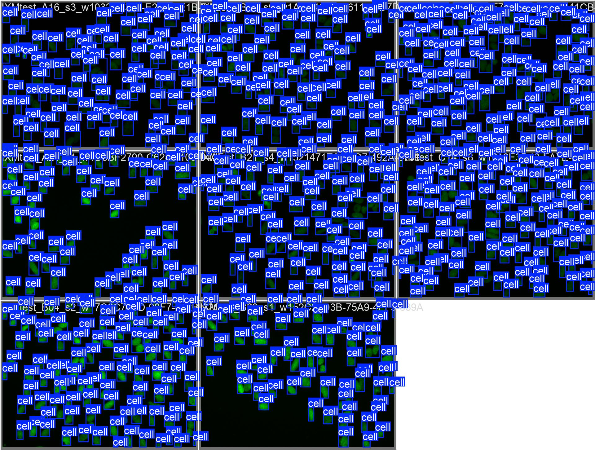
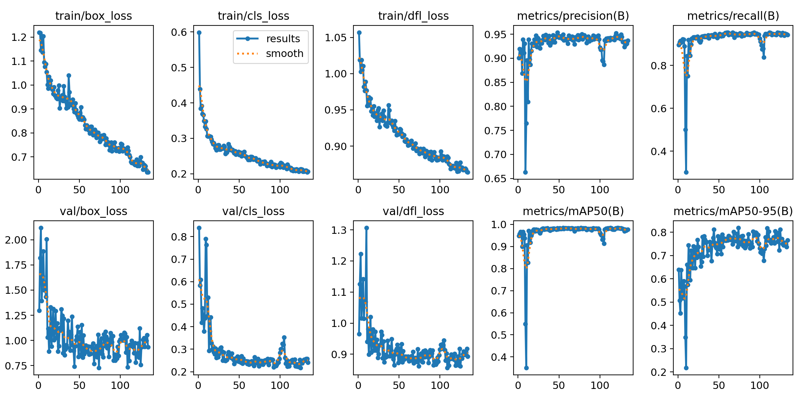
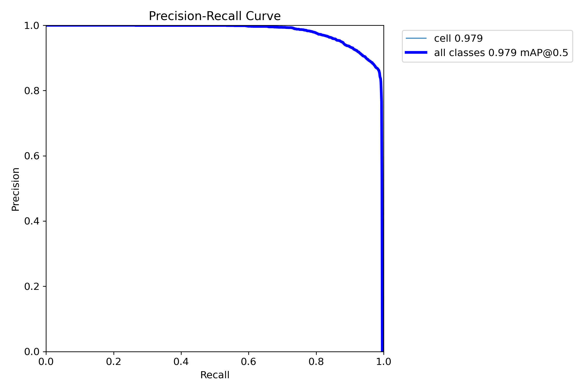

# MicroCC — Microscopy Cell Counter

[](https://colab.research.google.com/github/LSaiko/MicroCC/blob/main/bbbc039/usage_example.ipynb)

YOLOv8 nucleus **detection** for counting cells in fluorescence microscopy images.
Counting by detection (not segmentation): each nucleus gets a bounding box, the
count is `len(boxes)`. Faster at inference than instance segmentation and more
robust when nuclei touch.

Trained and evaluated on [BBBC039](https://bbbc.broadinstitute.org/BBBC039)
(U2OS cell nuclei, Hoechst stain, 520×696 single-channel TIFF).

**Topics:** `object-detection` · `yolov8` · `cell-counting` · `microscopy` ·
`fluorescence` · `bioimage-analysis` · `ultralytics` · `bbbc039`

## Results

`yolov8s`, 1280 px, best checkpoint (epoch 43), evaluated on the 40-image val split at conf 0.5:

| Metric | Value |
|---|---|
| mAP@50 | **0.979** |
| mAP@50:95 | **0.820** |
| Count MAE | **3.2** nuclei/image |
| Count MAPE | **3.2 %** |
| Count bias (pred − gt) | +84 over 3990 |

Baseline `yolov8s` at 640 px / default aug reached only mAP@50 0.55 — see
[Tuning](#tuning) for what moved it.

Predicted boxes (left) vs. ground truth (right) on a val batch:

<p float="left">
  
  
</p>

More predictions: [showcase/val_predictions_2.jpg](showcase/val_predictions_2.jpg)




## Setup

```bash
pip install ultralytics opencv-python-headless numpy pyyaml
```

Download the dataset from https://bbbc.broadinstitute.org/BBBC039 (images +
masks + metadata) and unzip so you have a folder of `*.tif` images and a folder
of `*.png` masks.

## Pipeline

```bash
# 1. masks -> YOLO bbox labels (handles BBBC039's interior/boundary semantic masks,
#    instance-labelled masks, and plain binary masks; empty masks -> empty .txt)
python bbbc039/masks_to_yolo.py --images Img/images --masks mask/masks --out labels

# 2. build the YOLO dataset: 3-channel PNGs + train/val split + dataset.yaml
python bbbc039/build_dataset.py --images Img/images --labels labels --out dataset --val-frac 0.2
#    (pass --splits <BBBC039_metadata_dir> to use the official 100/50/50 split)

# 3. train
python bbbc039/train.py --epochs 200 --patience 60 --imgsz 1280 --batch 4

# 4. evaluate: mAP@50, mAP@50:95, count MAE, count MAPE -> table + JSON
python bbbc039/evaluate.py --model runs/detect/*/weights/best.pt --data dataset/dataset.yaml
```

`python bbbc039/test_masks_to_yolo.py` runs the label-conversion self-check.

**Just want to count cells with the trained model?** See
[bbbc039/usage_example.ipynb](bbbc039/usage_example.ipynb)
[](https://colab.research.google.com/github/LSaiko/MicroCC/blob/main/bbbc039/usage_example.ipynb)
— downloads the release weights and runs inference on one image or a folder.
On Colab, set **Runtime → Change runtime type → GPU** before Run all (CPU works
but imgsz 1280 is slow); the first cell uploads your image.

## Tuning

Small objects (~20×20 px nuclei) on an 8 GB GPU:

- **imgsz 640 → 1280** — the single biggest lever for tiny objects.
- **`scale` 0.5 → 0.2** — default mosaic zoom-out was shrinking nuclei further.
- **`close_mosaic=20`, `mixup=0`** — disable aggressive aug near the end.
- **`hsv_h=0`, low `hsv_s/hsv_v`** — fluorescence is effectively single-channel; hue jitter is noise.
- **`box=8.5`** — weight localisation over classification (only one class).
- The P2 (stride-4) head helps in theory but OOMs at ≥640 px on 8 GB with ~100 objects/image; plain `yolov8s` at 1280 is the affordable equivalent.
- **Counting**: the model over-predicts at conf 0.25 (+16 %). A conf sweep on val minimises MAE near **conf 0.5–0.55** — `evaluate.py` defaults to 0.5.

## Notes

- On Windows, `train.py`/`evaluate.py` set `workers=0`: spawned dataloader
  workers each re-import CUDA and can exhaust the paging file.
- Weights and `runs/` are gitignored — retrain with step 3 (~25 min on an RTX 5060).

## License

Dual-licensed under either of

- MIT ([LICENSE-MIT](LICENSE-MIT))
- Apache License 2.0 ([LICENSE-APACHE](LICENSE-APACHE))

at your option.

The BBBC039 dataset is © the Broad Institute, released for use under the terms
on its [dataset page](https://bbbc.broadinstitute.org/BBBC039); cite Caicedo
et al. and the BBBC (Ljosa et al., Nature Methods, 2012) if you use it.
