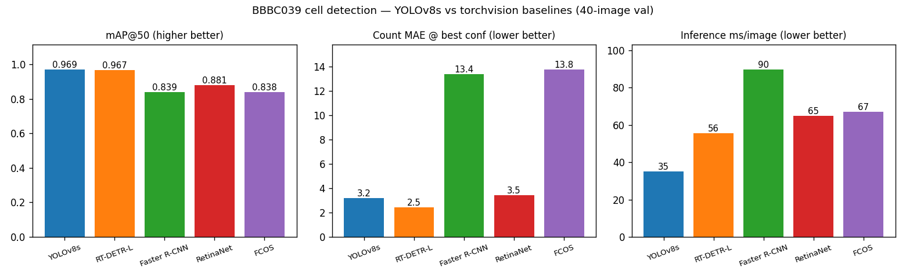

# Comparison study — YOLOv8s vs. 4 other detectors

Does the YOLO choice matter for counting nuclei, or would another detector do
as well? Trained four alternatives on the **same** BBBC039 split and scored all
five through **one** metric harness.

## Models

| Model | Type | Backbone | Params | Train res | Source |
|---|---|---|---|---|---|
| **YOLOv8s** | one-stage, anchor-free | CSPDarknet | 11 M | 1280 | `ultralytics` |
| **RT-DETR-L** | transformer, NMS-free set prediction | HGNetv2 | 32 M | 960 | `ultralytics` |
| **RetinaNet** | one-stage, dense, focal loss | ResNet50-FPN v2 | 36 M | ~800 | `torchvision` |
| **FCOS** | one-stage, anchor-free, FCN | ResNet50-FPN | 32 M | ~800 | `torchvision` |
| **Faster R-CNN** | two-stage (RPN + RoI head) | ResNet50-FPN v2 | 43 M | ~800 | `torchvision` |

All COCO-pretrained, head reset to 1 class, same 160/40 split, hflip aug,
trained on this RTX 5060 (8 GB). YOLO ~100 ep, RT-DETR 47 ep (converged),
torchvision 40 ep each (all plateaued by ~10).

## Results (40-image val split, one torchmetrics harness)

| Model | mAP@50 | mAP@75 | mAR@500 | count MAE @0.5 | best conf | **count MAE @best** | count MAPE @best | ms/img |
|---|---|---|---|---|---|---|---|---|
| **YOLOv8s** | **0.969** | 0.931 | 0.786 | 3.2 | 0.50 | **3.2** | 3.2 % | **35** |
| **RT-DETR-L** | 0.967 | **0.935** | **0.910** | 12.5 | 0.70 | **2.5** | **2.5 %** | 55 |
| RetinaNet | 0.881 | 0.861 | 0.822 | 17.9 | 0.25 | 3.5 | 3.5 % | 65 |
| FCOS | 0.838 | 0.837 | 0.796 | 13.8 | 0.50 | 13.8 | 12.0 % | 67 |
| Faster R-CNN | 0.839 | 0.837 | 0.785 | 14.8 | 0.80 | 13.4 | 11.3 % | 90 |



mAP@50:95 is omitted — torchmetrics caps that metric at 100 detections/image
internally, which unfairly penalises dense predictors on fields of up to ~165
nuclei. mAP@50 / mAP@75 / mAR use a 500-detection cap.

## Findings

1. **The field splits cleanly in two, and the line is the training recipe —
   not one-stage vs. two-stage vs. transformer.**
   - **YOLOv8s and RT-DETR-L** (modern, higher-res, strong aug): mAP@50 ~0.97.
   - **The three ResNet50-FPN torchvision nets** (Faster R-CNN, RetinaNet, FCOS),
     all at ~800 px: mAP@50 0.84–0.88, ~10 points back, regardless of detector
     family. A 20 px nucleus is ~12 px at that resolution.

2. **RT-DETR-L matches YOLOv8s and beats it where it counts.** Despite training
   at 960 px vs 1280, it ties on mAP@50 (0.967 vs 0.969), **wins mAP@75** (0.935,
   tighter boxes), **wins recall by a wide margin** (mAR@500 0.910 vs 0.786), and
   gives the **best counting result of all** — MAE 2.5 at conf 0.7. The NMS-free
   set prediction is the reason recall is so high: no true nucleus gets
   suppressed by an overlapping neighbour's box. Cost: 1.6× YOLO's latency
   (55 vs 35 ms).

3. **Counting accuracy is confidence-threshold-bound, per model.** At a fixed
   conf 0.5 the picture is misleading: RT-DETR looks bad (MAE 12.5), RetinaNet
   worse (17.9). Both are calibration, not capability — RT-DETR's optimum is
   0.70, RetinaNet's is 0.25 (focal loss pushes its scores low). After a
   per-model sweep, RT-DETR (2.5), YOLO (3.2) and RetinaNet (3.5) all land in
   the same band. **Anyone swapping detectors must re-sweep the threshold.**

4. **Faster R-CNN and FCOS are dominated** — worst mAP, worst counting even
   after tuning (MAE ~13–14), lowest recall. Faster R-CNN's RPN bottlenecks
   proposals on crowded fields; FCOS lands in the same place from the opposite
   (anchor-free FCN) direction. Neither offers anything here.

**Conclusion.** For a counting deployment: **YOLOv8s** if latency matters (best
speed, counting essentially tied). **RT-DETR-L** if accuracy is paramount and
you can afford 1.6× the latency — highest recall, best counting, tightest
boxes, and you can drop NMS. The torchvision CNNs would need to be retrained at
1280 px to be competitive; at default resolution they are not.

## Reproduce

```bash
python compare/train_tv.py --model fasterrcnn --epochs 40
python compare/train_tv.py --model retinanet  --epochs 40
python compare/train_tv.py --model fcos       --epochs 40
python compare/train_rtdetr.py --epochs 100 --imgsz 960   # converges ~ep 47
python compare/eval_all.py        # scores all 5, writes results.json
python compare/plot_results.py    # comparison.png
```

Weights are gitignored — retrain with the above. RT-DETR weights land under
`runs/detect/compare/runs/rtdetr/` (ultralytics path quirk); `eval_all.py`
globs for them.
